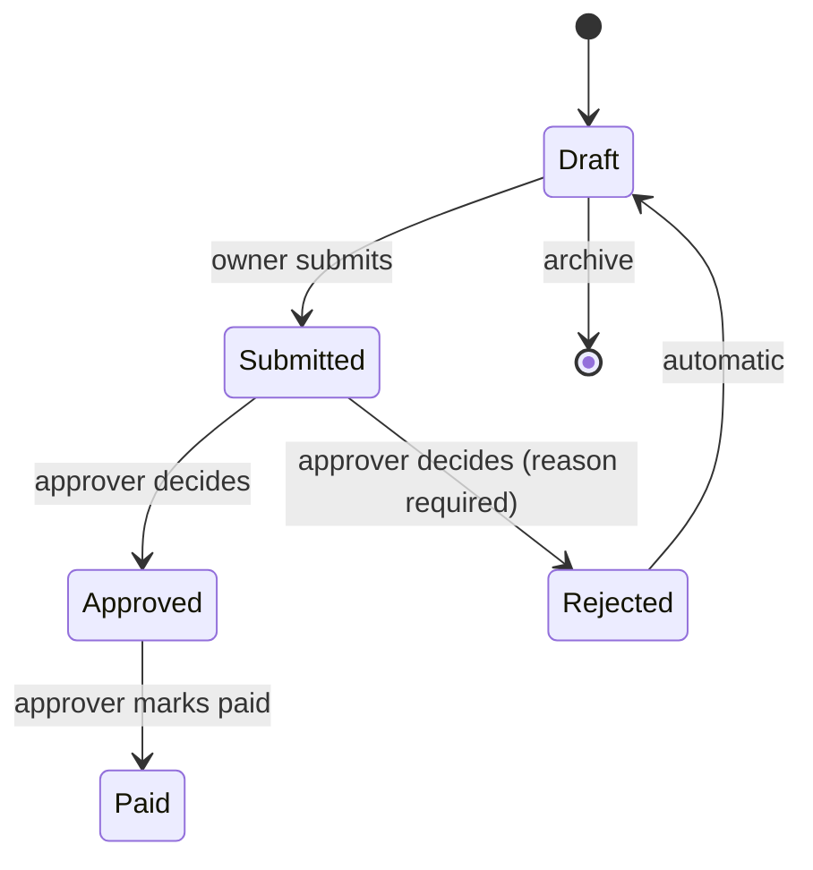
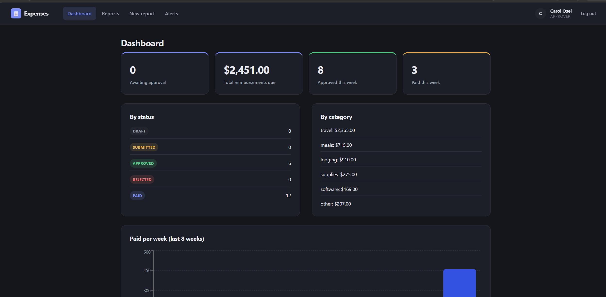
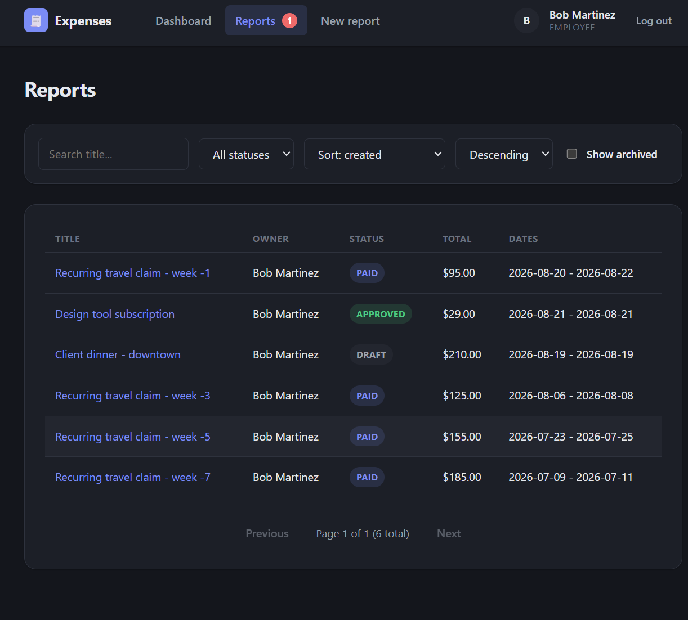
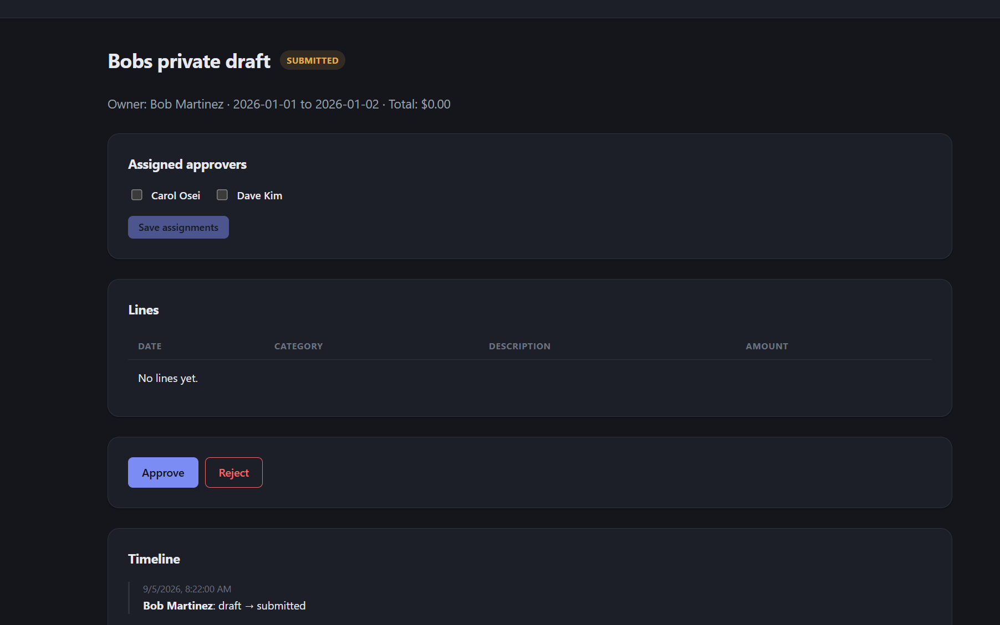
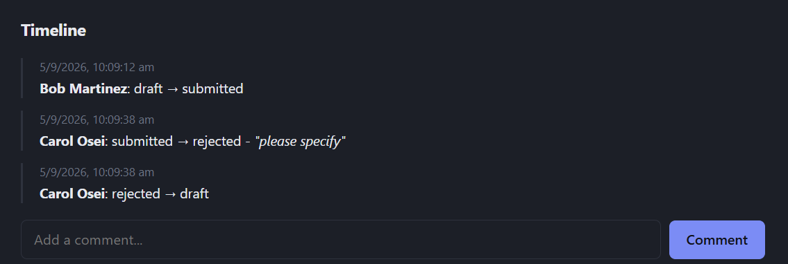
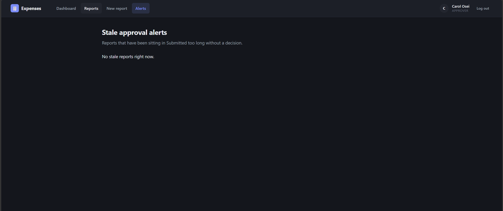

# Expense Reimbursement System

A full-stack expense reimbursement app: employees file expense reports line by line,
a separate approver reviews and decides on them, and finance can see exactly what's
owed and to whom without digging through an inbox.

**Live app:** https://busyinfo.vercel.app
**API (Swagger docs):** https://busyinfo.onrender.com/docs
**Repository:** https://github.com/divyansh-3371/busyinfo

> The backend is on Render's free tier, which sleeps after 15 minutes of
> inactivity — the first request after a cold start can take up to a minute. That's
> the backend spinning back up, not a broken deployment.

## Demo credentials

All demo users share the password `password123`.

| Role | Email | Password |
|------|-------|----------|
| Employee | alice@example.com | password123 |
| Employee | bob@example.com | password123 |
| Approver | carol@example.com | password123 |
| Approver | dave@example.com | password123 |

Demo data is seeded once and covers every status a report can be in — draft,
submitted, approved, rejected, paid — across multiple approvers, with comments and
reports old enough to trigger stale-approval alerts.

## The problem

Picture a mid-sized company where employees pay for travel, meals and supplies out
of pocket and get reimbursed by emailing a manager a spreadsheet with photos of
receipts attached. The manager replies "approved" to the thread, forwards it to
finance, and finance eventually issues a payment whenever they get to it.

The result is predictable:

- Finance can't say how much the company currently owes without opening every
  recent email thread and adding it up by hand.
- A manager who also travels for work ends up approving their own expense report,
  because nobody is checking who sent the "approved" reply against who submitted
  the spreadsheet.
- A rejected report gets a one-line reply explaining what was wrong, the employee
  means to fix it, and the whole thread quietly disappears into an inbox, never
  resubmitted.

This app replaces the email thread: employees submit expense reports with
individual line items, an approver who is never the employee themselves reviews and
decides on each one, and anyone can see at a glance what's awaiting approval and
what's approved but not yet paid.

## How it works

**Two roles.** Every user can create, edit and submit their own expense reports.
Approvers can additionally review and decide on reports submitted by other
employees — never their own, even though they hold the approver role. That rule is
enforced on the server, not just hidden in the UI: an approver who is also the
report's owner gets rejected by the same code path a stranger trying to approve
someone else's report would hit.

**Report lifecycle:**



Rejecting a report requires a reason and immediately hands the report back to the
owner as a draft they can edit and resubmit. A rejected report stays visibly marked
in the owner's reports list — and stays visible, frozen exactly as it was at the
moment of the decision, to the approver who rejected it — until the owner either
resubmits a fix or archives it. Every status change and every comment lives in an
append-only timeline: nothing in that history can be edited or deleted after the
fact, by anyone.

**Everything else a real approvals workflow needs:**

- Any number of approvers can be assigned to a report, by its owner or by any
  approver — assignment is a queue-filter convenience ("show me what's assigned to
  me"), not an access gate, since any approver can act on any submitted report.
- Server-side search, filtering (status/owner/approver), sorting and pagination
  over the full report list — never load-everything-then-filter-in-the-browser.
- Bulk approve/reject across many reports at once, with a per-report result that
  specifically calls out any report skipped because the approver owns it.
- CSV export of every approved-but-unpaid report, for handing to finance.
- A dashboard: reports awaiting approval, total reimbursements due, this week's
  approvals and payments, a status/category breakdown, and a paid-per-week chart.
- Stale-approval alerts for reports sitting in Submitted too long, with a
  navigation badge and a snooze that lets an alert reappear if still undecided.
- The reports list and an open report both auto-refresh, so a decision made by
  someone else shows up without a manual page reload.

## Screenshots

**Dashboard** — headline numbers, status/category breakdown, paid-per-week chart



**Reports list** — employee view; the red "1" on Reports is the unread-rejection badge



**Report detail** — approver assignment, line items, approve/reject, timeline



**Rejection in the timeline** — reason recorded, then the automatic return to draft



**Stale-approval alerts**



## Tech stack

| Layer | What's used | Why |
|-------|-------------|-----|
| Frontend | React 19 + TypeScript, Vite, React Router, Recharts | Fast dev loop, types shared against the backend's Pydantic schemas, Recharts for the dashboard chart. |
| Backend | Python, FastAPI, SQLAlchemy 2.x, Alembic, Pydantic v2 | Automatic request validation and OpenAPI docs made the authz/lifecycle rules — the actual substance of this app — fast to write and easy to verify by hand. |
| Database | PostgreSQL (Supabase) | Relational integrity (foreign keys, constraints on the audit trail) matters more here than flexibility — reports, lines, approvers and status events are all strictly relational. |
| Hosting | Render (backend) · Vercel (frontend) · Supabase (database) | Three free-tier services, each doing one job. |

The frontend and backend are two separate codebases talking over JSON HTTP: every
request carries a JWT, and the backend re-derives the current user and their role
from the database on every single call rather than trusting anything encoded in the
token — a role change or a report's state change takes effect on the very next
request, not after a token expires. Full write-up, including the request path for
one action end to end and what was deliberately left unbuilt, in
[`docs/architecture.md`](docs/architecture.md).

## Running it locally

**Backend**

```bash
cd backend
python -m venv .venv && .venv/Scripts/activate   # or source .venv/bin/activate
pip install -r requirements.txt
cp .env.example .env                              # then fill in DATABASE_URL, JWT_SECRET
alembic upgrade head
python seed.py
uvicorn app.main:app --reload
```

**Frontend**

```bash
cd frontend
npm install
cp .env.example .env.local                        # VITE_API_BASE_URL=http://localhost:8000
npm run dev
```

**Tests**

```bash
cd backend
pytest                                             # 97 tests: lifecycle rules, authz guards,
                                                    # bulk actions, CSV export, stale-alert math
```

## Documentation

- [`docs/architecture.md`](docs/architecture.md) — the moving pieces, where each one
  runs, and a request traced end to end.
- [`docs/schema.md`](docs/schema.md) — every table, what's denormalized and why.
- [`docs/decisions.md`](docs/decisions.md) — real trade-offs made along the way,
  including one reversed after more thought.
- [`docs/plan.md`](docs/plan.md) — how the work was actually split and sequenced.
- [`docs/ai-prompts.md`](docs/ai-prompts.md) — the actual prompt-by-prompt history of
  building this with AI assistance, including what went wrong and what was corrected.
- [`SUBMISSION.md`](SUBMISSION.md) — links, credentials, goal-by-goal status, and
  honest reflection on time spent and what's left.
